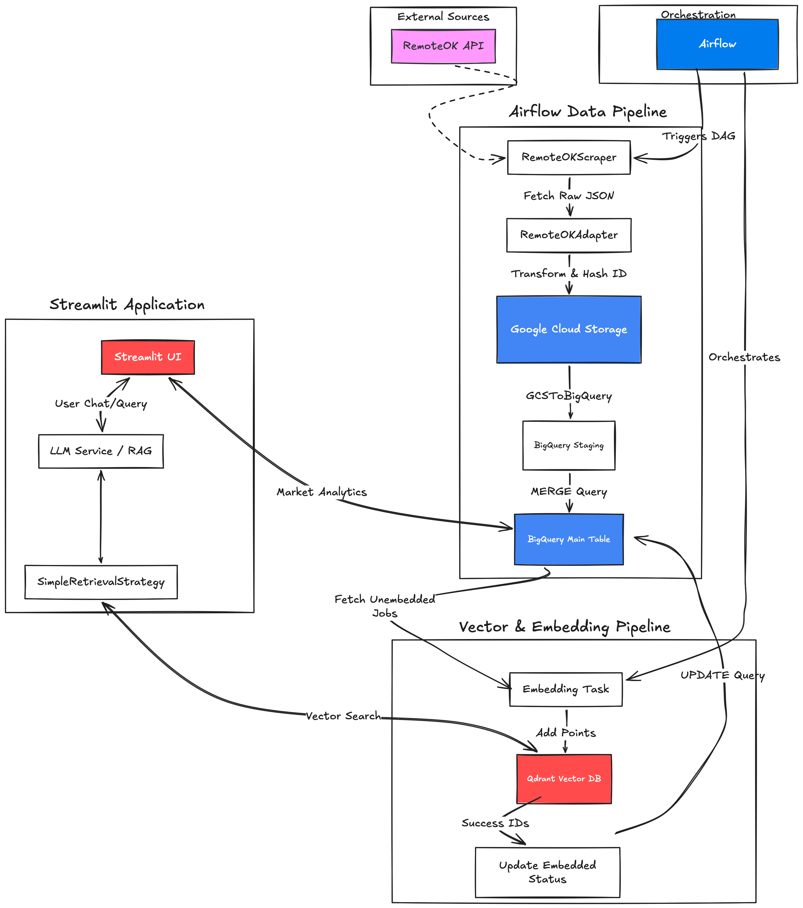

<h1 align="center">JobPulse</h1>
AI-powered job search assistant using RAG to help find relevant job postings.

Check out [demo](https://nakornb-jobpulse.streamlit.app/) here!

## ⚒️ Tech Stack
- **Airflow**: Workflow orchestration
- **Qdrant**: Vector database
- **BigQuery**: Data warehouse
- **GCS Bucket**: Data lake
- **Langchain**: RAG orchestration
- **HuggingFace**: Embeddings & LLM inference
- **Streamlit**: RAG chat interface

## 🏗️ Architecture


## 💻 Installation

### 1. Set environment variables
```bash 
cp .env.example .env
# Start services
docker compose up -d
```
### 2.  Run Application locally
It's recommended to run the Streamlit app outside Docker for faster reloads in development
```
# Install dependencies
uv sync # or pip install -r requirements.txt
# Run Streamlit
streamlit run demo.py
```

## Author
Nakorn Boonprasong \
Linkedln: https://www.linkedin.com/in/nakornb/ \
Email: boonprasonganakorn@gmail.com